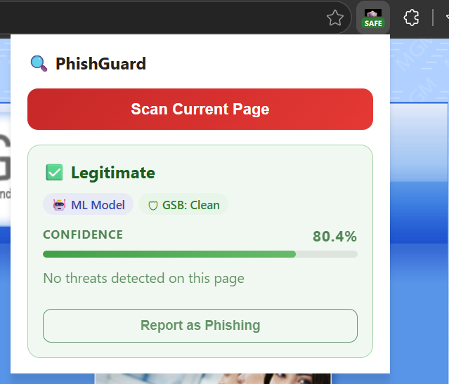
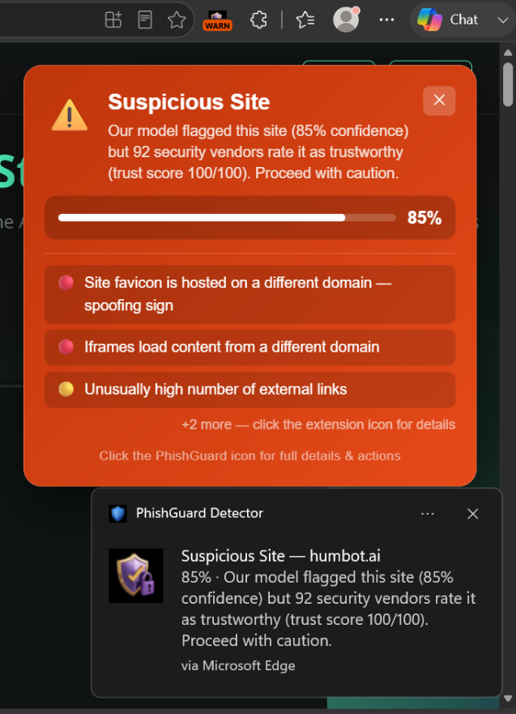
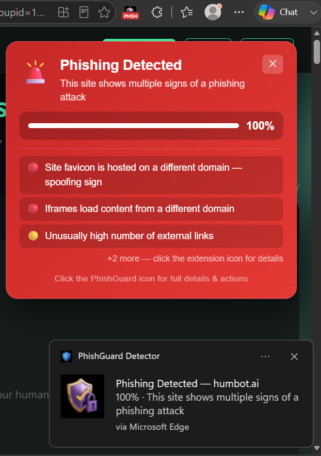
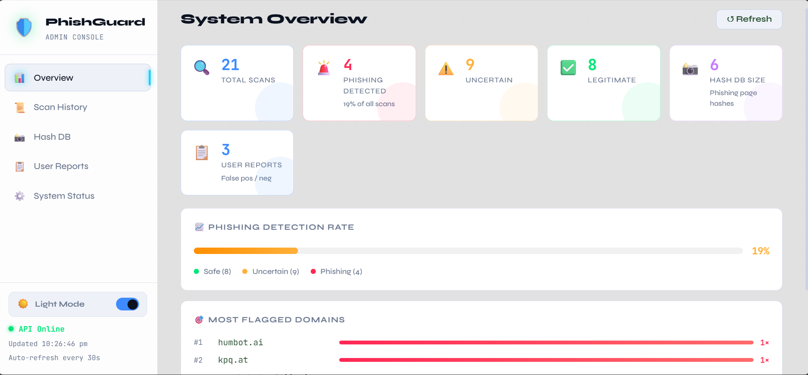
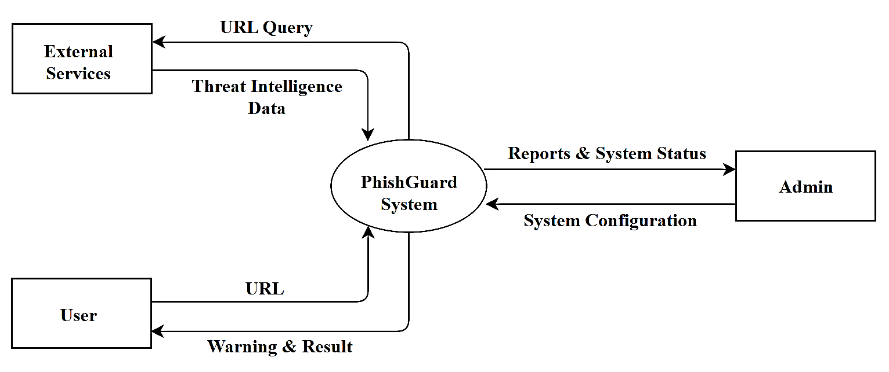
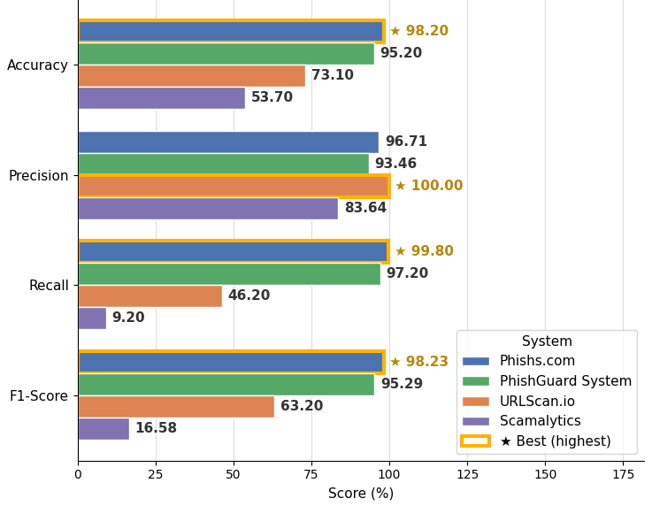

<div align="center">


# 🛡️ PhishGuard
### Real-Time Phishing Detection System

**A Chromium browser extension + FastAPI ML backend + React admin console that detects phishing websites in real time — combining a Random Forest & XGBoost ensemble model, live threat intelligence, and visual clone detection.**


</div>

---

## 📖 About the Project

**PhishGuard** is a real-time phishing website detection system built as an academic research project. It automatically scans every website a user visits and classifies it as **Legitimate**, **Uncertain**, or **Phishing** — warning the user before they ever type in a password.

Instead of relying on a single signal, PhishGuard fuses five independent detection layers into one decision:

1. **Machine Learning** — a Random Forest + XGBoost ensemble trained on **142 URL + webpage-content features**
2. **Trusted-domain whitelisting** — Tranco Top Sites, Majestic Million, Cisco Umbrella
3. **Live threat intelligence** — Google Safe Browsing, VirusTotal, PhishTank, OpenPhish
4. **WHOIS analysis** — domain age & registration period
5. **Visual clone detection** — perceptual hashing (pHash) of page screenshots to catch pixel-identical fakes hosted on a different URL

The system was benchmarked against **PhiUSIIL (504,933 labelled URLs)** for training, and evaluated on two independent, unseen real-world datasets — where it outperformed commercial services like **Phishs.com**, **URLScan.io**, and **Scamalytics**.

---

## ✨ Key Features

- 🔍 **Automatic background scanning** of every page the user visits, with a lightweight toolbar badge (`SAFE` / `WARN` / `PHSH`)
- ⚡ **In-page warning overlay + system notification** fire the instant a phishing or suspicious site is detected
- 🧠 **142-feature ML pipeline** — URL structure, HTTPS usage, IP-in-URL, subdomains, WHOIS age, forms, password fields, hidden iframes, favicon/title-domain mismatches, and more
- 🌐 **Multi-source threat intelligence** — Google Safe Browsing, VirusTotal, PhishTank, OpenPhish feeds
- 📸 **Visual clone detection** — flags sites that are pixel-perfect copies of previously reported phishing pages, even on a completely different domain
- 🗳️ **Explainable results** — every verdict comes with a human-readable "why we flagged this" reasons list, ranked by severity
- 🙋 **User feedback loop** — one-click "Report as Phishing" / "Mark as Safe" from the extension popup, which updates the live cache and hash database
- 📊 **React admin console** — live system overview, scan history, hash-database manager, user reports, and feed/whitelist status
- 🚀 **In-memory caching** everywhere (TTL result cache, WHOIS cache, VirusTotal cache) for fast repeat lookups, with a persisted JSON hash store for visual clones

---

## 🖥️ Screenshots

<table>
<tr valign="top">
<td width="33%" align="center"><b>Legitimate site</b><br></td>
<td width="33%" align="center"><b>Suspicious / Uncertain</b><br></td>
<td width="33%" align="center"><b>Phishing detected</b><br></td>
</tr>
</table>

<p align="center"><b>Admin Console — System Overview</b><br>
</p>

---

## 🏗️ Architecture

<p align="center">

</p>

**Detection flow:** the browser extension sends the current URL → the FastAPI backend checks it against the trusted-domain whitelist and result cache first (Tier 1) → if not resolved, it extracts URL + content features and runs the ML ensemble, while querying Google Safe Browsing, VirusTotal, PhishTank/OpenPhish, and comparing a screenshot hash against known phishing pages in parallel → all signals are merged by the decision engine into a final verdict, confidence score, and ranked list of reasons → the result is shown via the toolbar badge, an in-page overlay, and a system notification, and is also logged for the admin console.

### Repository Structure

```
Phishing-Detection-System/
├── backend/                  # FastAPI ML + threat-intel backend
│   ├── app.py                 # Feature extraction, ML inference, all API endpoints
│   ├── requirements.txt
│   ├── phishing_hashes.json   # Persisted visual-clone hash store
│   ├── 1LModel.joblib          # ⚠ trained model — not in repo, see Setup
│   └── 1LExtracted.csv         # ⚠ training URL list — not in repo, see Setup
├── frontend/                 # React admin console
│   ├── src/
│   └── package.json
├── phishing-extension/       # Manifest V3 Chrome/Edge extension
│   ├── background.js          # Service worker — auto-scan on navigation
│   ├── content.js             # In-page warning overlay
│   ├── popup.js / popup.html  # Extension popup UI
│   └── manifest.json
└── README.md
```

---

## ⚙️ Tech Stack

| Layer | Technology |
|---|---|
| **Backend** | Python, FastAPI, Uvicorn |
| **Machine Learning** | scikit-learn (Random Forest), XGBoost, joblib, pandas, NumPy |
| **Feature Extraction** | requests, BeautifulSoup4 + lxml, tldextract, python-whois |
| **Visual Clone Detection** | Pillow, ImageHash (perceptual hashing) |
| **Threat Intelligence** | Google Safe Browsing API, VirusTotal API, PhishTank, OpenPhish |
| **Trusted-Domain Feeds** | Tranco Top Sites, Majestic Million, Cisco Umbrella |
| **Admin Console** | React 19, react-scripts |
| **Browser Extension** | Manifest V3, JavaScript, HTML5, CSS3 |

---

## 🚀 Getting Started

### Prerequisites
- Python 3.10+
- Node.js + npm
- Google Chrome or Microsoft Edge (Manifest V3 support)
- (Optional but recommended) API keys for **Google Safe Browsing** and **VirusTotal** — the system runs without them, just with those checks skipped

### 1. Backend (FastAPI)

```bash
cd backend
python -m venv venv
venv\Scripts\activate        # Windows
# source venv/bin/activate   # macOS/Linux

pip install -r requirements.txt
```

Create a `.env` file inside `backend/` with your keys (all optional — the corresponding checks are skipped if missing):

```env
GOOGLE_SAFE_BROWSING_KEY=your_gsb_key
VIRUSTOTAL_API_KEYS=key1,key2
```

> ⚠️ **Note:** The trained model (`1LModel.joblib`) and training URL list (`1LExtracted.csv`) are excluded from this repo (they're ~105 MB and ~51 MB — too large for GitHub). Place your own trained files in `backend/` before starting the server, or retrain using the feature-extraction pipeline in `app.py`.

Run the server:

```bash
uvicorn app:app --reload --port 8000
```

### 2. Admin Console (React)

```bash
cd frontend
npm install
npm start
```

Opens at `http://localhost:3000` — only this origin is allowed by the backend's CORS policy.

### 3. Browser Extension

1. Open `chrome://extensions` (or `edge://extensions`)
2. Enable **Developer mode**
3. Click **Load unpacked** and select the `phishing-extension/` folder
4. Make sure the backend is running at `http://localhost:8000` — the extension talks to it directly

---

## 🔌 Key API Endpoints

| Endpoint | Method | Purpose |
|---|---|---|
| `/predict` | POST | Full scan — ML + threat intel + visual clone check → verdict, confidence, reasons |
| `/quick` | POST | Lightweight partial check |
| `/screenshot` | POST | Submit a page screenshot for clone comparison |
| `/hash/add` `/hash/remove-by-url` `/hash/list` `/hash/delete` | POST/GET/DELETE | Manage the visual-clone hash database |
| `/report` | POST | Submit a user false-positive / false-negative report |
| `/cache-stats` `/cache/clear` `/cache/update` | GET/POST | Inspect / manage the in-memory result cache |
| `/feed-status` `/whitelist-status` `/static-whitelist` | GET | Status of phishing feeds & trusted-domain lists |
| `/scan-history` `/admin-stats` `/admin/clear-history` | GET/POST | Data powering the React admin console |

---

## 📊 Performance

Evaluated against independent, unseen real-world datasets and benchmarked against existing phishing-detection services:

<p align="center">

</p>

The combined **URL + webpage-content** feature set consistently outperformed URL-only and content-only feature sets across all tested dataset sizes (20,000–100,000 URLs), with the Random Forest + XGBoost ensemble achieving over **99% accuracy** on the training benchmark.

---

## 🎓 Project Background

This system is **Phase 2** of a larger academic research project, *"Simulation and Detection of Phishing Attacks for Online Security,"* submitted for the M.Sc. Computer Science program at **Mahatma Gandhi Memorial College, Udupi (Mangalore University)**.

---

## 👤 Author

**Thejas P Karkera**
[LinkedIn](https://www.linkedin.com/in/thejas-p-karkera/) · [GitHub](https://github.com/Thejas-p-karkera)

---

<div align="center">
<sub>Built as an academic research project. Not licensed for reuse or distribution.</sub>
</div>
